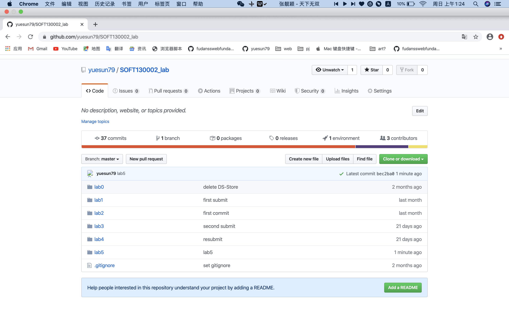
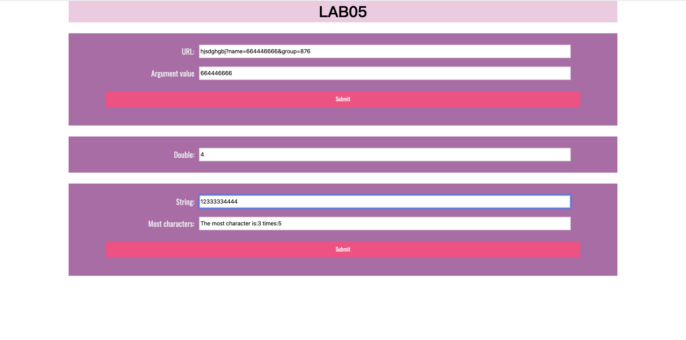

# Lab5文档

### 1.

```
function showWindowHref(){
    let url_input = url.value;
    let url_array = url_input.split(/[?=&]/);
    let name_num = url_array.indexOf("name");
    if (name_num === -1)
        url_result.value = "hasn't found name";
    else
        url_result.value = url_array[name_num + 1];
}
```

获得url的内容（即字符串），使用`.split(/[?=&]/);`将字符串以?、=、&的为分隔符的**字符串数组**。

寻找在该字符串数组中**"name"的index**——name_num,即`name_num = url_array.indexOf("name");`，则`url_array[name_num + 1];`对应字符串中**name的参数**。

当在字符串数组中寻找不到那么"name",则返回**hasn't found name**。

### 2.

```
window.onload = timeTest();

function timeTest(){
    let mul_result = 1;
    let count = 0;
    let int = setInterval(run,5000);
    function run() {
        mul.value = mul_result;
        console.log(mul_result);
        let date = new Date();
        mul_result *= 2;
        count++;
        let seconds = date.getSeconds();
        console.log(seconds);
        if (count === 1 && seconds === 0)
            window.clearInterval(int);
        if (count !== 1 && seconds < 5 || count === 10)
            window.clearInterval(int);
        }
    }
```

`mul_result`是要赋予给**mul.value**，显示在input里的值,其初始值为1。

`int = setInterval(run,5000);`可按照五秒的周期来调用函数run()。

赋值机制：run()函数第一次运行先初始赋值并获取当前时间；之后run()函数运行赋值上次run()运行时乘二的mul_result并获取当前时间。

为了满足**经过**整分钟停止这一条件: 

 ***（具体执行情况可看控制台）***

**我的停止规则1是：只有初始赋值”1“的秒数为0时，输入框才不会翻倍，初始赋值为其他秒数时都会翻倍。**故首先检验`if (count === 1 && seconds === 0)`

**我的停止规则2是：若当前秒数是56，输入框值为a，输入框值会翻倍为2a后停止**，如果`date.getSeconds()`获取当前秒数小于五秒执行 `window.clearInterval(int);`run()函数的调用被停止，翻倍停止。

### 3.

```
most.addEventListener('input',arrSameStr);
most_submit.addEventListener('click',arrSameStr);

function  arrSameStr() {
    let str = most.value;
    console.log(str);
    let obj={};
    for(let i = 0; i < str.length; i++){
        if(obj[str.charAt(i)]){
            obj[str.charAt(i)]++;
        }else{
            obj[str.charAt(i)] = 1;
        }
    }
    let sum=0;
    let number;
    for(let key in obj){
        if (obj[key]>sum) {
            sum=obj[key];
            number=key
        }
    }
    result.value = "The most character is:" + number + " times:" + sum;
}
```

***因为输入框是实时响应，submit键仿佛是个装饰 XD***

获取输入的字符串并建立一个对象，在字符串的长度范围内循环：如果第i个字符已经是对象的属性了，那么属性值+1；如果 第i个字符不是对象的属性，那就给对象定义一个相应名字的属性，并将属性值赋成1。

然后遍历对象找出属性值最大的，并记录它对应的属性值。

### 截屏

github截屏：



lab5网页截屏：




